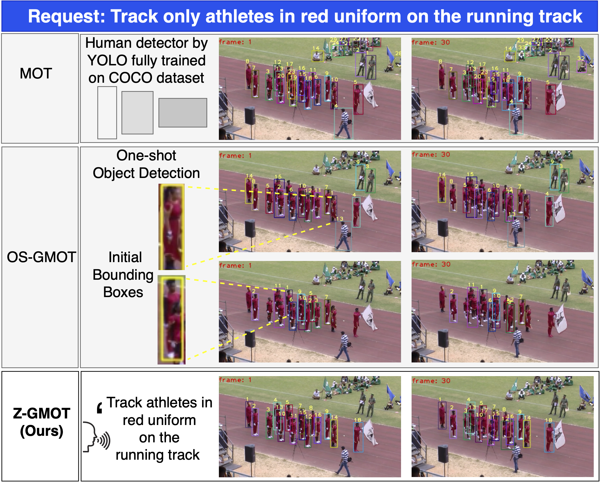

# Z-GMOT: Zero-shot Generic Multiple Object Tracking

<p align="center">
  
</p>

## Updates

- **15/03/2024** 🎉: Z-GMOT has been accepted to **NAACL Findings 2024**!

## Introduction

This repository contains the source code for [Z-GMOT](https://fsoft-aic.github.io/Z-GMOT/).

Our dataset is available [here](https://drive.google.com/drive/folders/1OTEiQr93EFMKyfKM9NAI4EPxKYWfUkkG?usp=drive_link).

> **Note:** This link contains only processed bounding boxes and captions. The videos should be downloaded from the original datasets (GMOT40, AnimalTrack, DanceTrack, MOT) referenced in the paper.

Our code for object grounding is built upon [GLIP](https://github.com/microsoft/GLIP). Since we do not fine-tune or retrain the models, the model weights/checkpoints should be downloaded from the original GLIP repository.

Our proposed MA-SORT is built upon [Deep-OC-SORT](https://github.com/gerardmaggiolino/deep-oc-sort), with the Re-ID model obtained from [cosine_metric_learning](https://github.com/nwojke/cosine_metric_learning).

## Inference

Using GMOT40 as an example:

1. **Object grounding.** To run our zero-shot object grounding, execute:

   ```bash
   python demo/finetune_iglip_gmot40.py
   ```

   This step produces the object bounding boxes.

2. **Object association.** To run our proposed MA-SORT, execute:

   ```bash
   bash MA-Sort/run_csod_macsort.sh
   ```

## Citation

If you find this work useful, please consider citing our paper:

```bibtex
@inproceedings{tran-etal-2024-z,
    title = "{Z}-{GMOT}: Zero-shot Generic Multiple Object Tracking",
    author = "Tran, Kim  and
      Le Dinh, Anh Duy  and
      Nguyen, Tien-Phat  and
      Phan, Thinh  and
      Nguyen, Pha  and
      Luu, Khoa  and
      Adjeroh, Donald  and
      Doretto, Gianfranco  and
      Le, Ngan",
    editor = "Duh, Kevin  and
      Gomez, Helena  and
      Bethard, Steven",
    booktitle = "Findings of the Association for Computational Linguistics: NAACL 2024",
    month = jun,
    year = "2024",
    address = "Mexico City, Mexico",
    publisher = "Association for Computational Linguistics",
    url = "https://aclanthology.org/2024.findings-naacl.220/",
    doi = "10.18653/v1/2024.findings-naacl.220",
    pages = "3468--3479"
}
```
